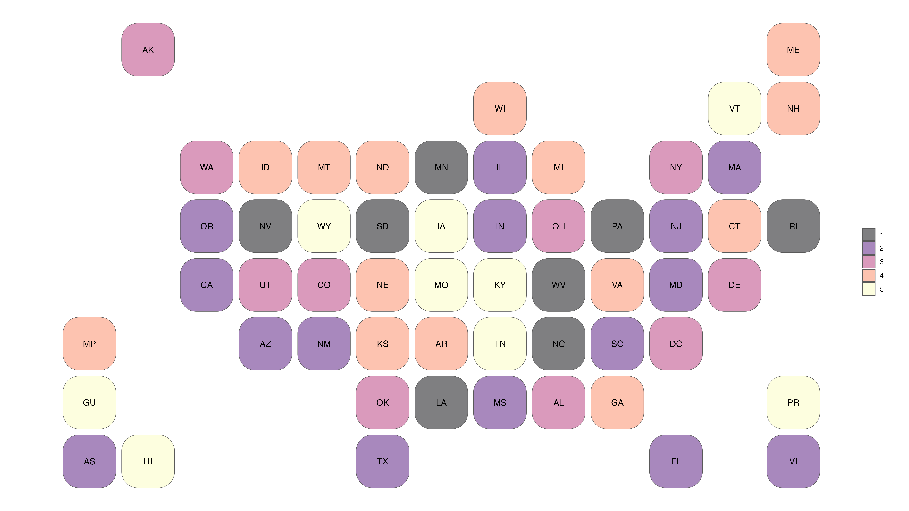
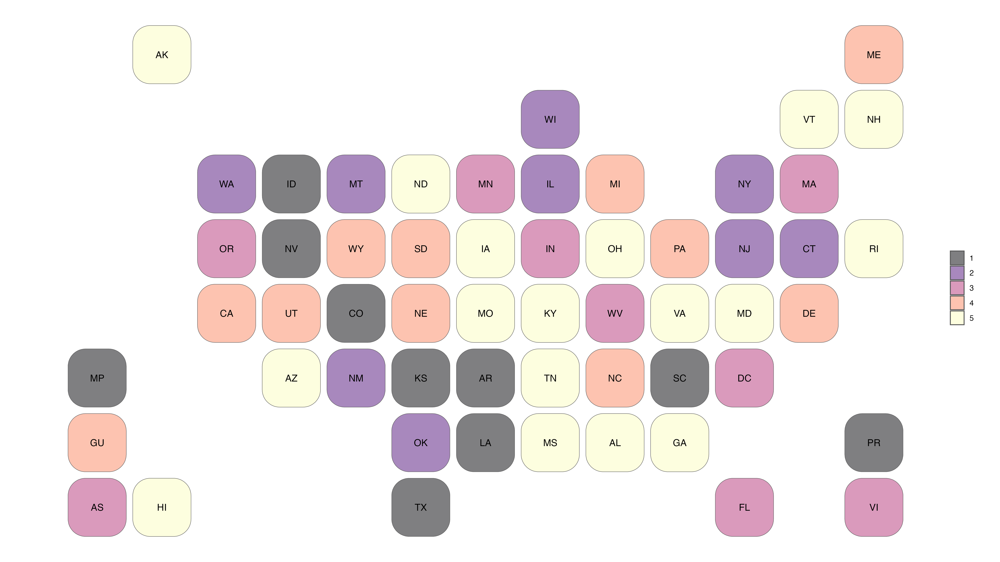

# State and territory cartogram heatmap files

Cartogram heatmaps like those created with the
[statebins](https://github.com/hrbrmstr/statebins) R package usefully preserve
the general placement of states while removing differences in size that can skew
interpretation of data unrelated to land area. This repository creates
lightweight GeoJSON and TopoJSON cartogram heatmap files that can be used in any
GIS program or package that accepts such files. In addition, they include
squares for the five permanently inhabited US territories: American Samoa, Guam,
Northern Mariana Islands, Puerto Rico, and the U.S. Virgin Islands.

Pre-built spatial files are located in the `geo` directory.

# Examples
**GeoJSON**

**TopoJSON**

# Building the files

## Required packages

- `tidyverse`
- `sf`
- `geojsonio`
- `crosswalkr`
- `viridis`

## To build

To build the `geojson` and `topojson` files, make `./scripts` the working
directory, and run `make_geo_data.R`.

To create the example figures, next run `make_example_figures.R`.

# Acknowledgments

The arrangement of the map tiles is modified from code provided in the
[statebins](https://github.com/hrbrmstr/statebins) R package.

